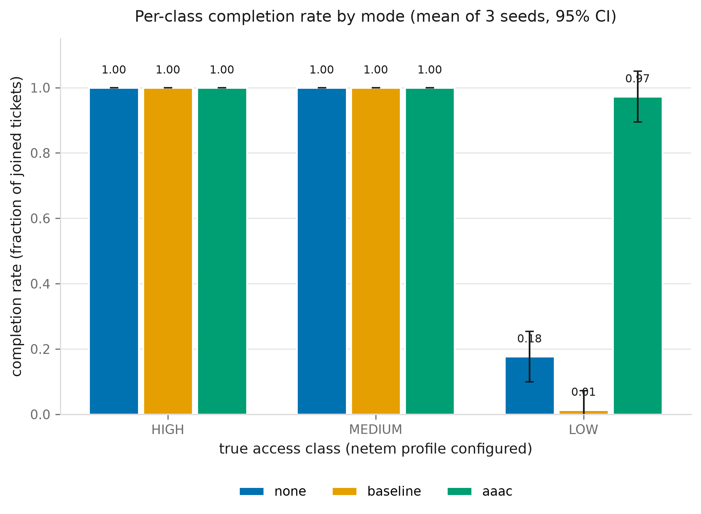
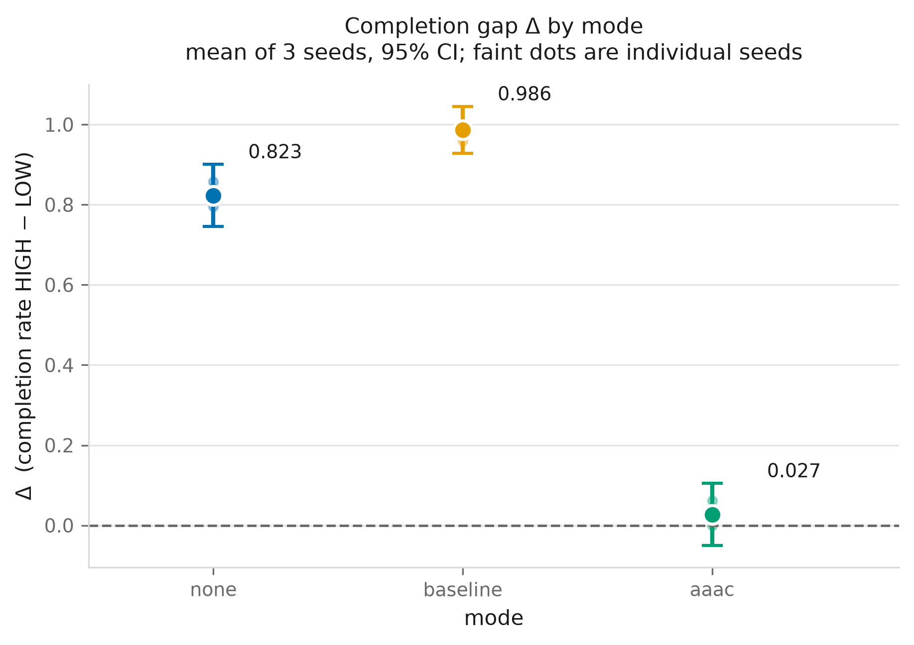
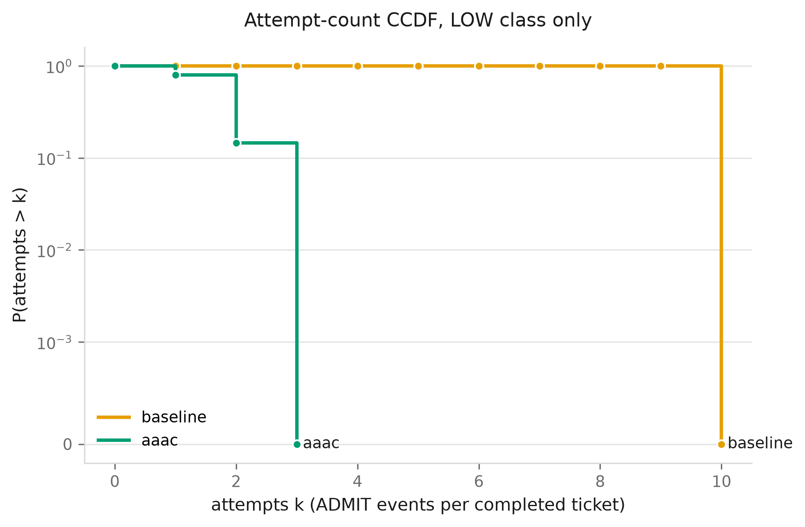
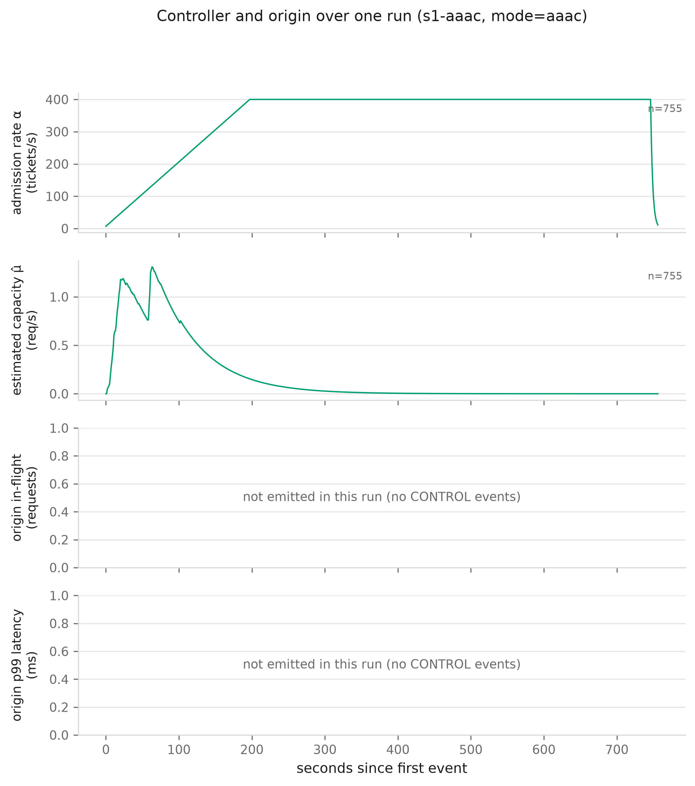
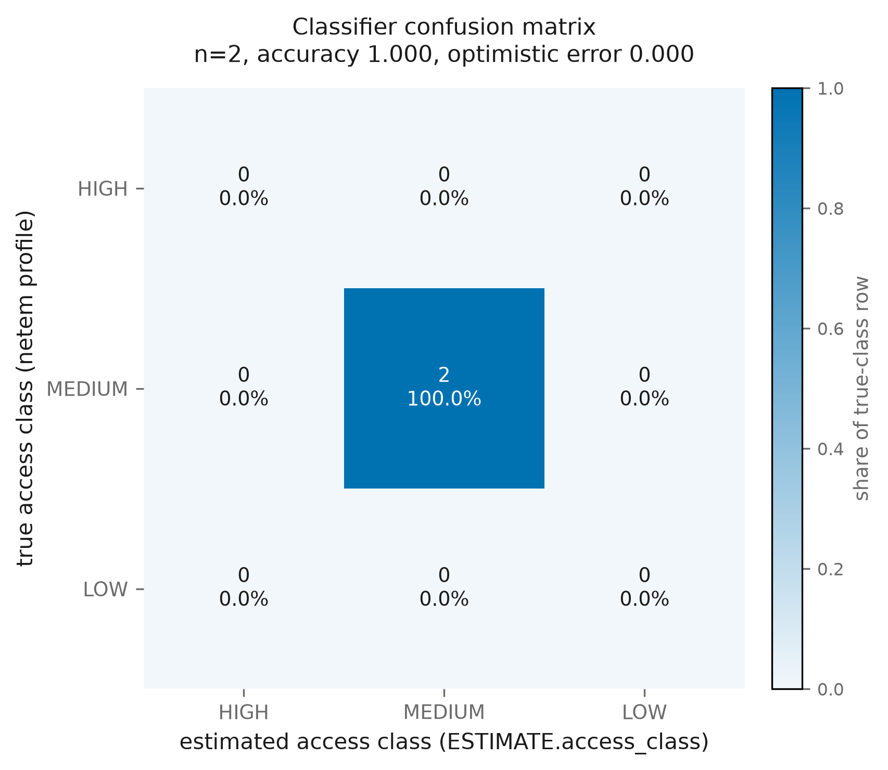

# AAAC evaluation report — `final`

Generated 2026-09-25 00:04:43 UTC by `aaac.evaluation.report`. Every number below is computed from the event log; none is hand-typed.

- seeds: `1, 2, 3` (3 total)
- modes: `none, baseline, aaac`
- runs: 9

**Identical-load check (§4.3).** All modes within a seed replay the same population. Population hashes seen: `0baa649c1345`, `18bd1aa2e823`, `91544c8c3ed2` (3 distinct, one per seed).

## Per-mode results

**mode `none`** — Δ across seeds: 0.8231 [0.7457, 0.9006] (t, df=2)

### `none` · seed 1

| class | joined | completed | completion rate | TTC median (s) | TTC p95 (s) | censored | attempts mean | attempts p95 | attempts max | goodput |
|---|---:|---:|---:|---:|---:|---:|---:|---:|---:|---:|
| HIGH | 35 | 35 | 1.0000 | 0.36 | 0.44 | 0 | 1.00 | 1.00 | 1 | 1.0000 |
| MEDIUM | 56 | 56 | 1.0000 | 15.13 | 25.53 | 0 | 1.00 | 1.00 | 1 | 1.0000 |
| LOW | 49 | 10 | 0.2041 | 330.82 | 422.14 | 39 | 1.00 | 1.00 | 1 | 1.0000 |
| ALL (aggregate) | 140 | 101 | 0.7214 | 9.60 | 303.92 | 39 | 1.00 | 1.00 | 1 | 1.0000 |

- **Δ** = `completion_rate[HIGH] − completion_rate[LOW]` = **0.7959**
- **Jain's index** over the three per-class completion rates = 0.7931

**Origin stability** (from `ORIGIN_SAMPLE`) — confirms protection is not sacrificed:

- samples: 644
- mean 5xx rate: 0.000000 (max 0.000000)
- p99 latency: mean 56.3 ms, max 378.9 ms

<details><summary>Provenance for the table above</summary>

```
source(s)        : results/events-s1-none.jsonl, results/origin-s1-none.jsonl
run / mode       : s1-none / none
events used      : ADMIT, COMPLETE, CONTROL, DOWNGRADE, JOIN, ORIGIN_SAMPLE, REQUEUE, TIMEOUT
tickets seen     : 140
tickets included : 140
disaggregated by : true_class
  excluded       : 0
completers       : 101 (non-completers censored from time-to-completion: 39)
WARNING          : ORIGIN_SAMPLE covers only 643.0s of the 653.6s run. Origin stability figures describe part of the run only.
WARNING          : 101 COMPLETE event(s) carried no `ok` field and were counted as successful. §4.4 defines completion as COMPLETE(ok=true); this inference holds only while the admission service logs a failed completion as ABANDON rather than COMPLETE(ok=false). If that convention changes, this count is wrong.
WARNING          : 322 TIMEOUT event(s) carried no `bytes` field, so the bytes burned on those attempts are unknown and missing from the denominator. Goodput is therefore an UPPER BOUND, not the §4.4 figure.
```
</details>

### `none` · seed 2

| class | joined | completed | completion rate | TTC median (s) | TTC p95 (s) | censored | attempts mean | attempts p95 | attempts max | goodput |
|---|---:|---:|---:|---:|---:|---:|---:|---:|---:|---:|
| HIGH | 35 | 35 | 1.0000 | 0.41 | 13.32 | 0 | 1.00 | 1.00 | 1 | 1.0000 |
| MEDIUM | 56 | 56 | 1.0000 | 18.75 | 27.74 | 0 | 1.04 | 1.00 | 2 | 1.0000 |
| LOW | 49 | 7 | 0.1429 | 291.32 | 373.51 | 42 | 1.00 | 1.00 | 1 | 1.0000 |
| ALL (aggregate) | 140 | 98 | 0.7000 | 14.29 | 272.67 | 42 | 1.02 | 1.00 | 2 | 1.0000 |

- **Δ** = `completion_rate[HIGH] − completion_rate[LOW]` = **0.8571**
- **Jain's index** over the three per-class completion rates = 0.7576

**Origin stability** (from `ORIGIN_SAMPLE`) — confirms protection is not sacrificed:

- samples: 628
- mean 5xx rate: 0.000000 (max 0.000000)
- p99 latency: mean 45.8 ms, max 345.6 ms

<details><summary>Provenance for the table above</summary>

```
source(s)        : results/events-s2-none.jsonl, results/origin-s2-none.jsonl
run / mode       : s2-none / none
events used      : ADMIT, COMPLETE, CONTROL, DOWNGRADE, ESTIMATE, JOIN, ORIGIN_SAMPLE, REQUEUE, TIMEOUT
tickets seen     : 140
tickets included : 140
disaggregated by : true_class
  excluded       : 0
completers       : 98 (non-completers censored from time-to-completion: 42)
WARNING          : ORIGIN_SAMPLE covers only 627.0s of the 637.1s run. Origin stability figures describe part of the run only.
WARNING          : 98 COMPLETE event(s) carried no `ok` field and were counted as successful. §4.4 defines completion as COMPLETE(ok=true); this inference holds only while the admission service logs a failed completion as ABANDON rather than COMPLETE(ok=false). If that convention changes, this count is wrong.
WARNING          : 350 TIMEOUT event(s) carried no `bytes` field, so the bytes burned on those attempts are unknown and missing from the denominator. Goodput is therefore an UPPER BOUND, not the §4.4 figure.
WARNING          : classifier accuracy covers 4 of 140 tickets. The other 136 have no ESTIMATE event: never classified, or an estimate that was rejected. Rejected estimates are not logged, so the log cannot tell the two apart.
```
</details>

### `none` · seed 3

| class | joined | completed | completion rate | TTC median (s) | TTC p95 (s) | censored | attempts mean | attempts p95 | attempts max | goodput |
|---|---:|---:|---:|---:|---:|---:|---:|---:|---:|---:|
| HIGH | 35 | 35 | 1.0000 | 0.36 | 6.30 | 0 | 1.03 | 1.00 | 2 | 1.0000 |
| MEDIUM | 56 | 56 | 1.0000 | 26.08 | 32.61 | 0 | 1.00 | 1.00 | 1 | 1.0000 |
| LOW | 49 | 9 | 0.1837 | 355.01 | 507.36 | 40 | 1.67 | 4.60 | 7 | 1.0000 |
| ALL (aggregate) | 140 | 100 | 0.7143 | 16.32 | 341.49 | 40 | 1.07 | 1.00 | 7 | 1.0000 |

- **Δ** = `completion_rate[HIGH] − completion_rate[LOW]` = **0.8163**
- **Jain's index** over the three per-class completion rates = 0.7816

**Origin stability** (from `ORIGIN_SAMPLE`) — confirms protection is not sacrificed:

- samples: 650
- mean 5xx rate: 0.000000 (max 0.000000)
- p99 latency: mean 57.2 ms, max 345.6 ms

<details><summary>Provenance for the table above</summary>

```
source(s)        : results/events-s3-none.jsonl, results/origin-s3-none.jsonl
run / mode       : s3-none / none
events used      : ADMIT, COMPLETE, CONTROL, DOWNGRADE, ESTIMATE, JOIN, ORIGIN_SAMPLE, REQUEUE, TIMEOUT
tickets seen     : 140
tickets included : 140
disaggregated by : true_class
  excluded       : 0
completers       : 100 (non-completers censored from time-to-completion: 40)
WARNING          : ORIGIN_SAMPLE covers only 649.0s of the 658.3s run. Origin stability figures describe part of the run only.
WARNING          : 100 COMPLETE event(s) carried no `ok` field and were counted as successful. §4.4 defines completion as COMPLETE(ok=true); this inference holds only while the admission service logs a failed completion as ABANDON rather than COMPLETE(ok=false). If that convention changes, this count is wrong.
WARNING          : 324 TIMEOUT event(s) carried no `bytes` field, so the bytes burned on those attempts are unknown and missing from the denominator. Goodput is therefore an UPPER BOUND, not the §4.4 figure.
WARNING          : classifier accuracy covers 2 of 140 tickets. The other 138 have no ESTIMATE event: never classified, or an estimate that was rejected. Rejected estimates are not logged, so the log cannot tell the two apart.
```
</details>

**mode `baseline`** — Δ across seeds: 0.9864 [0.9279, 1.0449] (t, df=2)

### `baseline` · seed 1

| class | joined | completed | completion rate | TTC median (s) | TTC p95 (s) | censored | attempts mean | attempts p95 | attempts max | goodput |
|---|---:|---:|---:|---:|---:|---:|---:|---:|---:|---:|
| HIGH | 35 | 35 | 1.0000 | 16.60 | 36.05 | 0 | 1.00 | 1.00 | 1 | 1.0000 |
| MEDIUM | 56 | 56 | 1.0000 | 24.63 | 47.37 | 0 | 1.00 | 1.00 | 1 | 1.0000 |
| LOW | 49 | 0 | 0.0000 | n/a | n/a | 49 | n/a | n/a | n/a | n/a |
| ALL (aggregate) | 140 | 91 | 0.6500 | 19.70 | 43.93 | 49 | 1.00 | 1.00 | 1 | 1.0000 |

- **Δ** = `completion_rate[HIGH] − completion_rate[LOW]` = **1.0000**
- **Jain's index** over the three per-class completion rates = 0.6667

**Origin stability** (from `ORIGIN_SAMPLE`) — confirms protection is not sacrificed:

- samples: 636
- mean 5xx rate: 0.000000 (max 0.000000)
- p99 latency: mean 88.1 ms, max 378.9 ms

<details><summary>Provenance for the table above</summary>

```
source(s)        : results/events-s1-baseline.jsonl, results/origin-s1-baseline.jsonl
run / mode       : s1-baseline / baseline
events used      : ADMIT, COMPLETE, CONTROL, DOWNGRADE, ESTIMATE, JOIN, ORIGIN_SAMPLE, REQUEUE, TIMEOUT
tickets seen     : 140
tickets included : 140
disaggregated by : true_class
  excluded       : 0
completers       : 91 (non-completers censored from time-to-completion: 49)
WARNING          : ORIGIN_SAMPLE covers only 635.0s of the 644.4s run. Origin stability figures describe part of the run only.
WARNING          : 91 COMPLETE event(s) carried no `ok` field and were counted as successful. §4.4 defines completion as COMPLETE(ok=true); this inference holds only while the admission service logs a failed completion as ABANDON rather than COMPLETE(ok=false). If that convention changes, this count is wrong.
WARNING          : 781 TIMEOUT event(s) carried no `bytes` field, so the bytes burned on those attempts are unknown and missing from the denominator. Goodput is therefore an UPPER BOUND, not the §4.4 figure.
WARNING          : classifier accuracy covers 57 of 140 tickets. The other 83 have no ESTIMATE event: never classified, or an estimate that was rejected. Rejected estimates are not logged, so the log cannot tell the two apart.
```
</details>

### `baseline` · seed 2

| class | joined | completed | completion rate | TTC median (s) | TTC p95 (s) | censored | attempts mean | attempts p95 | attempts max | goodput |
|---|---:|---:|---:|---:|---:|---:|---:|---:|---:|---:|
| HIGH | 35 | 35 | 1.0000 | 18.63 | 47.12 | 0 | 1.00 | 1.00 | 1 | 1.0000 |
| MEDIUM | 56 | 56 | 1.0000 | 21.77 | 44.57 | 0 | 1.00 | 1.00 | 1 | 1.0000 |
| LOW | 49 | 0 | 0.0000 | n/a | n/a | 49 | n/a | n/a | n/a | n/a |
| ALL (aggregate) | 140 | 91 | 0.6500 | 20.67 | 47.02 | 49 | 1.00 | 1.00 | 1 | 1.0000 |

- **Δ** = `completion_rate[HIGH] − completion_rate[LOW]` = **1.0000**
- **Jain's index** over the three per-class completion rates = 0.6667

**Origin stability** (from `ORIGIN_SAMPLE`) — confirms protection is not sacrificed:

- samples: 644
- mean 5xx rate: 0.000000 (max 0.000000)
- p99 latency: mean 69.8 ms, max 345.6 ms

<details><summary>Provenance for the table above</summary>

```
source(s)        : results/events-s2-baseline.jsonl, results/origin-s2-baseline.jsonl
run / mode       : s2-baseline / baseline
events used      : ADMIT, COMPLETE, CONTROL, DOWNGRADE, ESTIMATE, JOIN, ORIGIN_SAMPLE, REQUEUE, TIMEOUT
tickets seen     : 140
tickets included : 140
disaggregated by : true_class
  excluded       : 0
completers       : 91 (non-completers censored from time-to-completion: 49)
WARNING          : ORIGIN_SAMPLE covers only 643.0s of the 652.6s run. Origin stability figures describe part of the run only.
WARNING          : 91 COMPLETE event(s) carried no `ok` field and were counted as successful. §4.4 defines completion as COMPLETE(ok=true); this inference holds only while the admission service logs a failed completion as ABANDON rather than COMPLETE(ok=false). If that convention changes, this count is wrong.
WARNING          : 775 TIMEOUT event(s) carried no `bytes` field, so the bytes burned on those attempts are unknown and missing from the denominator. Goodput is therefore an UPPER BOUND, not the §4.4 figure.
WARNING          : classifier accuracy covers 62 of 140 tickets. The other 78 have no ESTIMATE event: never classified, or an estimate that was rejected. Rejected estimates are not logged, so the log cannot tell the two apart.
```
</details>

### `baseline` · seed 3

| class | joined | completed | completion rate | TTC median (s) | TTC p95 (s) | censored | attempts mean | attempts p95 | attempts max | goodput |
|---|---:|---:|---:|---:|---:|---:|---:|---:|---:|---:|
| HIGH | 35 | 35 | 1.0000 | 18.62 | 42.20 | 0 | 1.00 | 1.00 | 1 | 1.0000 |
| MEDIUM | 56 | 56 | 1.0000 | 25.06 | 41.70 | 0 | 1.11 | 2.00 | 2 | 1.0000 |
| LOW | 49 | 2 | 0.0408 | 585.40 | 590.42 | 47 | 10.00 | 10.00 | 10 | 1.0000 |
| ALL (aggregate) | 140 | 93 | 0.6643 | 23.66 | 43.44 | 47 | 1.26 | 2.00 | 10 | 1.0000 |

- **Δ** = `completion_rate[HIGH] − completion_rate[LOW]` = **0.9592**
- **Jain's index** over the three per-class completion rates = 0.6936

**Origin stability** (from `ORIGIN_SAMPLE`) — confirms protection is not sacrificed:

- samples: 659
- mean 5xx rate: 0.000000 (max 0.000000)
- p99 latency: mean 75.0 ms, max 345.6 ms

<details><summary>Provenance for the table above</summary>

```
source(s)        : results/events-s3-baseline.jsonl, results/origin-s3-baseline.jsonl
run / mode       : s3-baseline / baseline
events used      : ADMIT, COMPLETE, CONTROL, DOWNGRADE, ESTIMATE, JOIN, ORIGIN_SAMPLE, REQUEUE, TIMEOUT
tickets seen     : 140
tickets included : 140
disaggregated by : true_class
  excluded       : 0
completers       : 93 (non-completers censored from time-to-completion: 47)
WARNING          : ORIGIN_SAMPLE covers only 658.0s of the 667.0s run. Origin stability figures describe part of the run only.
WARNING          : 93 COMPLETE event(s) carried no `ok` field and were counted as successful. §4.4 defines completion as COMPLETE(ok=true); this inference holds only while the admission service logs a failed completion as ABANDON rather than COMPLETE(ok=false). If that convention changes, this count is wrong.
WARNING          : 799 TIMEOUT event(s) carried no `bytes` field, so the bytes burned on those attempts are unknown and missing from the denominator. Goodput is therefore an UPPER BOUND, not the §4.4 figure.
WARNING          : classifier accuracy covers 57 of 140 tickets. The other 83 have no ESTIMATE event: never classified, or an estimate that was rejected. Rejected estimates are not logged, so the log cannot tell the two apart.
```
</details>

**mode `aaac`** — Δ across seeds: 0.0272 [-0.0502, 0.1047] (t, df=2)

### `aaac` · seed 1

| class | joined | completed | completion rate | TTC median (s) | TTC p95 (s) | censored | attempts mean | attempts p95 | attempts max | goodput |
|---|---:|---:|---:|---:|---:|---:|---:|---:|---:|---:|
| HIGH | 35 | 35 | 1.0000 | 2.26 | 4.31 | 0 | 1.00 | 1.00 | 1 | 1.0000 |
| MEDIUM | 56 | 56 | 1.0000 | 2.69 | 4.91 | 0 | 1.00 | 1.00 | 1 | 1.0000 |
| LOW | 49 | 46 | 0.9388 | 43.23 | 52.67 | 3 | 1.93 | 3.00 | 3 | 1.0000 |
| ALL (aggregate) | 140 | 137 | 0.9786 | 2.75 | 50.55 | 3 | 1.31 | 2.00 | 3 | 1.0000 |

- **Δ** = `completion_rate[HIGH] − completion_rate[LOW]` = **0.0612**
- **Jain's index** over the three per-class completion rates = 0.9991

**Origin stability** (from `ORIGIN_SAMPLE`) — confirms protection is not sacrificed:

- samples: 746
- mean 5xx rate: 0.000000 (max 0.000000)
- p99 latency: mean 14.0 ms, max 378.9 ms

<details><summary>Provenance for the table above</summary>

```
source(s)        : results/events-s1-aaac.jsonl, results/origin-s1-aaac.jsonl
run / mode       : s1-aaac / aaac
events used      : ADMIT, COMPLETE, CONTROL, DOWNGRADE, ESTIMATE, JOIN, ORIGIN_SAMPLE, REQUEUE, TIMEOUT
tickets seen     : 140
tickets included : 140
disaggregated by : true_class
  excluded       : 0
completers       : 137 (non-completers censored from time-to-completion: 3)
WARNING          : 137 COMPLETE event(s) carried no `ok` field and were counted as successful. §4.4 defines completion as COMPLETE(ok=true); this inference holds only while the admission service logs a failed completion as ABANDON rather than COMPLETE(ok=false). If that convention changes, this count is wrong.
WARNING          : 85 TIMEOUT event(s) carried no `bytes` field, so the bytes burned on those attempts are unknown and missing from the denominator. Goodput is therefore an UPPER BOUND, not the §4.4 figure.
WARNING          : classifier accuracy covers 2 of 140 tickets. The other 138 have no ESTIMATE event: never classified, or an estimate that was rejected. Rejected estimates are not logged, so the log cannot tell the two apart.
```
</details>

### `aaac` · seed 2

| class | joined | completed | completion rate | TTC median (s) | TTC p95 (s) | censored | attempts mean | attempts p95 | attempts max | goodput |
|---|---:|---:|---:|---:|---:|---:|---:|---:|---:|---:|
| HIGH | 35 | 35 | 1.0000 | 4.25 | 8.63 | 0 | 1.00 | 1.00 | 1 | 1.0000 |
| MEDIUM | 56 | 56 | 1.0000 | 2.89 | 10.17 | 0 | 1.00 | 1.00 | 1 | 1.0000 |
| LOW | 49 | 49 | 1.0000 | 44.63 | 54.34 | 0 | 2.04 | 3.00 | 3 | 1.0000 |
| ALL (aggregate) | 140 | 140 | 1.0000 | 4.74 | 51.34 | 0 | 1.36 | 3.00 | 3 | 1.0000 |

- **Δ** = `completion_rate[HIGH] − completion_rate[LOW]` = **0.0000**
- **Jain's index** over the three per-class completion rates = 1.0000

**Origin stability** (from `ORIGIN_SAMPLE`) — confirms protection is not sacrificed:

- samples: 103
- mean 5xx rate: 0.000000 (max 0.000000)
- p99 latency: mean 86.3 ms, max 345.6 ms

<details><summary>Provenance for the table above</summary>

```
source(s)        : results/events-s2-aaac.jsonl, results/origin-s2-aaac.jsonl
run / mode       : s2-aaac / aaac
events used      : ADMIT, COMPLETE, CONTROL, DOWNGRADE, ESTIMATE, JOIN, ORIGIN_SAMPLE, REQUEUE, TIMEOUT
tickets seen     : 140
tickets included : 140
disaggregated by : true_class
  excluded       : 0
completers       : 140 (non-completers censored from time-to-completion: 0)
WARNING          : 140 COMPLETE event(s) carried no `ok` field and were counted as successful. §4.4 defines completion as COMPLETE(ok=true); this inference holds only while the admission service logs a failed completion as ABANDON rather than COMPLETE(ok=false). If that convention changes, this count is wrong.
WARNING          : 55 TIMEOUT event(s) carried no `bytes` field, so the bytes burned on those attempts are unknown and missing from the denominator. Goodput is therefore an UPPER BOUND, not the §4.4 figure.
WARNING          : classifier accuracy covers 5 of 140 tickets. The other 135 have no ESTIMATE event: never classified, or an estimate that was rejected. Rejected estimates are not logged, so the log cannot tell the two apart.
```
</details>

### `aaac` · seed 3

| class | joined | completed | completion rate | TTC median (s) | TTC p95 (s) | censored | attempts mean | attempts p95 | attempts max | goodput |
|---|---:|---:|---:|---:|---:|---:|---:|---:|---:|---:|
| HIGH | 35 | 35 | 1.0000 | 4.28 | 6.35 | 0 | 1.00 | 1.00 | 1 | 1.0000 |
| MEDIUM | 56 | 56 | 1.0000 | 4.81 | 6.99 | 0 | 1.00 | 1.00 | 1 | 1.0000 |
| LOW | 49 | 48 | 0.9796 | 44.77 | 53.70 | 1 | 1.85 | 3.00 | 3 | 1.0000 |
| ALL (aggregate) | 140 | 139 | 0.9929 | 5.15 | 51.21 | 1 | 1.29 | 2.00 | 3 | 1.0000 |

- **Δ** = `completion_rate[HIGH] − completion_rate[LOW]` = **0.0204**
- **Jain's index** over the three per-class completion rates = 0.9999

**Origin stability** (from `ORIGIN_SAMPLE`) — confirms protection is not sacrificed:

- samples: 117
- mean 5xx rate: 0.000000 (max 0.000000)
- p99 latency: mean 86.8 ms, max 345.6 ms

<details><summary>Provenance for the table above</summary>

```
source(s)        : results/events-s3-aaac.jsonl, results/origin-s3-aaac.jsonl
run / mode       : s3-aaac / aaac
events used      : ADMIT, COMPLETE, CONTROL, DOWNGRADE, JOIN, ORIGIN_SAMPLE, REQUEUE, TIMEOUT
tickets seen     : 140
tickets included : 140
disaggregated by : true_class
  excluded       : 0
completers       : 139 (non-completers censored from time-to-completion: 1)
WARNING          : 139 COMPLETE event(s) carried no `ok` field and were counted as successful. §4.4 defines completion as COMPLETE(ok=true); this inference holds only while the admission service logs a failed completion as ABANDON rather than COMPLETE(ok=false). If that convention changes, this count is wrong.
WARNING          : 47 TIMEOUT event(s) carried no `bytes` field, so the bytes burned on those attempts are unknown and missing from the denominator. Goodput is therefore an UPPER BOUND, not the §4.4 figure.
```
</details>

### Classifier accuracy

n = 2, accuracy = 1.0000

| true \ estimated | HIGH | MEDIUM | LOW | recall |
|---|---:|---:|---:|---:|
| **HIGH** | 0 | 0 | 0 | n/a |
| **MEDIUM** | 0 | 2 | 0 | 1.0000 |
| **LOW** | 0 | 0 | 0 | n/a |

- **Optimistic error rate**: 0.0000 — a client judged *more capable than it is*. This is the error that matters: it sends a slow client a payload it cannot fetch.
- Pessimistic error rate: 0.0000

## Hypothesis test (pre-registered — see `src/aaac/evaluation/README.md`)

### HYPOTHESIS SUPPORTED

- ✅ **Delta reduced, paired 95% CI excludes zero** — mean Delta baseline 0.9864, aaac 0.0272; paired difference 0.9592 [0.8714, 1.0470] (excludes zero); paired t = 47.000, p = 0.0005
- ✅ **Origin 5xx rate not worse under aaac** — mean err rate baseline 0.000000, aaac 0.000000
- ✅ **HIGH-class p95 TTC within 20% of baseline** — baseline 41.79s, aaac 6.43s (-84.6%)

| quantity | mean | 95% CI | method |
|---|---:|---|---|
| Δ (baseline) | 0.9864 | [0.9279, 1.0449] | t, df=2 |
| Δ (aaac) | 0.0272 | [-0.0502, 0.1047] | t, df=2 |
| paired Δ(baseline) − Δ(aaac) | 0.9592 | [0.8714, 1.0470] | t, df=2 |

> **Wilcoxon signed-rank withheld.** n=3: the smallest attainable two-sided p is 0.2500, so this test cannot reject at 0.05 regardless of effect size. Reporting a p-value from a test that could not have rejected would be misleading; run ≥ 6 seeds if a rank test is wanted.

> **NOTE.** Only 3 seeds. §4.5 requires a minimum of 5; this verdict is under-powered and must not be presented as the headline result.

## Figures










